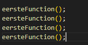
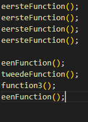

## functions stap voor stap


## starten

Ga verder in: `function_oefening.js`

## onze functions

we hebben nu 4 functions:

- met de naam `eersteFunction`
- met de naam `tweedeFunction`
- met de naam `eenFunction`
- met de naam `function3`

Die doen niets, en worden nog niet gebruikt
Dat is stap 2: hoe gebruiken we een function?

## Aanroepen

Om een function te gebruiken, roepen we de function aan.
Dit noemen we een `function call`.

- zet je cursor onderaan in `function_oefening.js`
- type nu de naam `eersteFunction`
- zet hier `()` achter en daarna een `;`

```  
dat was de eerste function call.
``` 
## herhalen

Een function kan je meerdere keren aanroepen. Laten we dat doen:

- `call` nu nog 3 keer de function `eersteFunction`
</br>

## Nu de rest!

We hebben nog 3 andere functions. Die gaan we ook gebruiken

- `call` nu `eenFunction`
- `call` daaronder `tweedeFunction` 2x
- `call` daaronder `function3` 2x
- `call` nu `eenFunction` 1x
</br>


## herhalen en oefenen

commit naar je git!