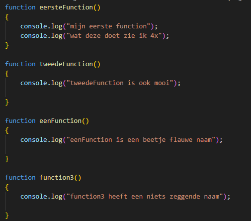
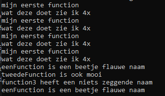

## functions stap voor stap


## starten

Ga verder in: `function_oefening.js`

## onze functions

we hebben nu 4 functions:

- met de naam `eersteFunction`
- met de naam `tweedeFunction`
- met de naam `eenFunction`
- met de naam `function3`

Die doen niets, maar worden wel gebruikt.
Hoe laten we deze iets doen?

## Function body 

Weet je nog wat de function body was? 
``` 
 Dat is alle code tussen de `{` en `}` die achter `function NAAM()` staan
``` 
- type het volgende over in je file:
</br>
``` 
* de code die we tussen de `{}` hebben gezet is de code in de function body
* die hoort dus bij de function
``` 
## Testen

Run nu je code met nodejs en dan zie je:
</br>


## herhalen en oefenen

commit naar je git!