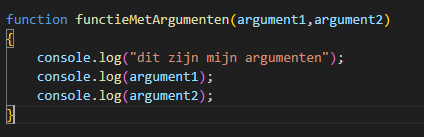
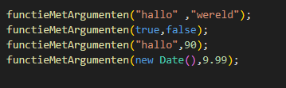
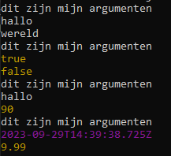
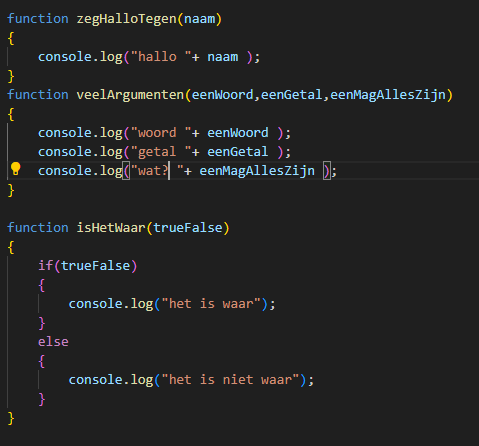
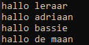
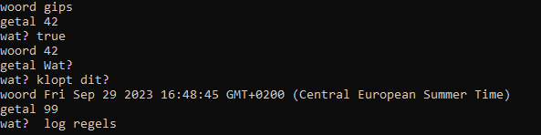

## functions stap voor stap


## starten

Ga verder in: `function_oefening.js`

## onze functions

we hebben nu 4 functions:

- met de naam `eersteFunction`
- met de naam `tweedeFunction`
- met de naam `eenFunction`
- met de naam `function3`

Die nu iets en worden wel gebruikt.

Maar functions kunnen ook iets meekrijgen als ze gebruikt worden.

## Argumenten

Dat noemen we `argumenten`, dat zijn `variablen` waar een `waarde` in komt, die dan in de function gebruikt kan worden

- type deze function over:
</br>

## Call met argumenten

- type onder de `functieMetArgumenten` functie de calls:
</br>

- test je code, run het met node
* als het goed is zie je het volgende:
</br>

## Zelf argumenten tikken

- type over:
</br>

## aanroepen

Dat moeten we ook doen:

- type nu `zegHalloTegen("leraar");`
- type nu `zegHalloTegen("adriaan");`
- type nu `zegHalloTegen("bassie");`
- type nu `zegHalloTegen("de maan");`
- test in node js:
</br>

* zie je dat dezelfde code wordt gebruikt?
* maar dat alleen een `naam` elke keer een andere `waarde` heeft?
* dat is de kracht van functions

## Zelf proberen

- `call` nu zelf `veelArgumenten` met de waarden:
``` 
* "gips"
* 42
* true
``` 
- `call` nu zelf `veelArgumenten` met de waarden:
``` 
* 42
* "Wat?"
* "klopt dit?"
``` 
- `call` nu zelf `veelArgumenten` met de waarden:
``` 
* new Date()
* 99
* " log regels"
``` 
</br>

## isHetWaar

- `call` nu zelf `isHetWaar` met de waarden:
```
* true
``` 
- `call` nu zelf `isHetWaar` met de waarden:
``` 
* false
``` 

## Inleveren

commit naar je git!