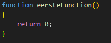

## functions stap voor stap


## starten

Maak een nieuwe file: `function_oefening_deel2.js`

## start function maken


- maak eerst weer het standaard patroon:

</br>
- maak nu nog 3 andere functions:
``` 
* `returnIets1`
* `returnIets2`
* `returnIets3`
``` 

Nu hebben we 4 `lege` functions die `niets` doen en geen `argumenten` hebben

## Return


`return` is waarmee we een function een resultaat kunnen laten teruggeven.
- verander de `eerstefunction` zodat deze er zo uitziet 
</br>

``` 
* Nu geeft onze function een `0` terug, dat is een nummer.
* het `return type` van deze function is nu `Number`.
``` 


## En nu dan?

Hoe gebruiken we het resultaat?
``` 
* straks maken eerst we een variable 
* in die variable kunnen we het resultaat opvangen
* je kan ook het resultaat direct gebruiken
``` 
1) direct gebruiken


- type het volgende onder aan in `function_oefening_deel2.js`:
</br>
- test je code, dan krijg je het volgende: 
</br>

``` 
* wat er gebeurt: 
    * de function voert uit en heeft als resultaat `0`
    * de statement `eersteFunction()` wordt daarna dus `0`
    * dan gaat die `0` de `console.log` function in
    * dus het wordt `console.log(0)` tijdens het uitvoeren
``` 

2) opvangen in een variable

- voeg het volgende nu onder aan in `function_oefening_deel2.js`:
</br>
- test je code, dan krijg je het volgende:
</br>

## is dat hetzelfde dan?

Nu wel als je de code draait.
Maar bij nummer 2 kunnen we de `0` in `deNulKomtHierIn` later nog een keer gebruiken:
</br> 

- test je code, dan krijg je het volgende: 
</br> 
``` 
* wie bewaart die heeft wat!
``` 
## Inleveren

commit naar je git!