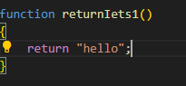
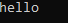
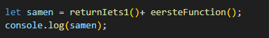
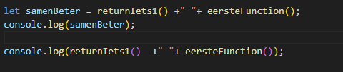
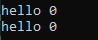
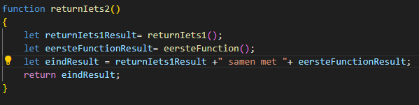
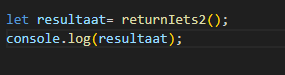
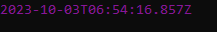

## functions stap voor stap


## starten

Ga verder in de file: `function_oefening_deel2.js`

## start function maken

we hebben 4 functions:

- `eerstefunction`
- `returnIets1`
- `returnIets2`
- `returnIets3`

## Andere returns


- verander de `returnIets1` zodat deze er zo uitziet
</br>

``` 
* Nu geeft onze function een `hello` terug, dat is een string.
* het `return type` van deze function is nu `String`.
``` 

Je ziet dat als je veranderd wat je teruggeeft de `return type` ook kan veranderen.

## Call & log

- onderaan de file `call` je nu `returnIets1`
- sla het resultaat op in een variabel met de naam :
 `eenString`

``` 
gebruik het patroon van de `eerstefunction()` call van de vorige oefening
```

- `console.log` nu de `eenString` variable
- test je code:
</br>

## Call and use


we gaan nu 2 resultaten samen voegen.
- type het volgende over onderaan in je file:
</br>
- test je code:
</br>

``` 
* dat is niet echt mooi, het zit nog aan elkaar geplakt
``` 
- type het volgende over onderaan in je file:
</br>
- test je code:
</br>

``` 
* Beter! 
zie je hoe we 2 function resultaten gebruiken?
``` 

## Function Call in een function

Nu gaan we wat verder:
- in `returnIets2` gaan we het volgende typen:
</br>
- call nu onderaan in je file `returnIets2`
- vang dat `resultaat` in een `variabele` op. en `console.log` het
- test je code:
</br>

```
* zie je hoe we in `returnIets2` `returnIets1` en `eerstefunction` gebruiken om een nieuw resultaat te maken?
* en dat we DAT resultaat dan weer returnen uit `returnIets2`?
```

## de laatste

verander `returnIets3` nu zelf:
- `return` het volgende `new Date()`
- `call` dan `returnIets3`
- vang het resulataat in een variable met naam: `klaar`
- `console.log` klaar om het een `datum tijd` te krijgen:
</br>

```
* LETOP, de datum zal anders zijn dan die in het plaatje!
```

## Inleveren

commit naar je git!