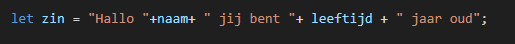
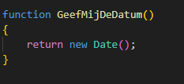
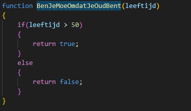
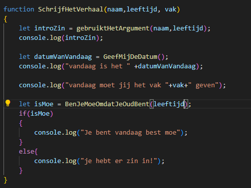
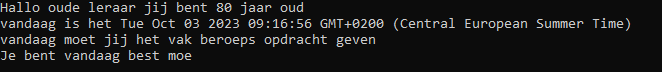

## functions stap voor stap

We gaan nu returns en argumenten combineren

## starten

Maak een nieuwe file: `function_oefening_deel3.js`

## start function maken

Laten we eerst even een function maken:
- noem je function `gebruiktHetArgument`
- geef je function 2 argumenten: `naam` en `leeftijd`
- zet nu de volgende code in je function:
</br>

- `call` nu onderaan in je file `gebruiktHetArgument`
```
* gebruik voor naam: leraar
* gebruik voor leeftijd 80
```
- vang dat `resultaat` in een `variabele` op. en `console.log` het
- test je code:
</br>

```
* zie je hoe we argumenten (naam en leeftijd) meegeven bij de call?
* zie je dat die argumenten variablen zijn in de function die we gebruiken?
* zie je dat die argumenten dan de waarden van buiten de function hebben?
```


## nog eentje dan!

Zullen we nu alles even combineren? 

We maken de volgende functions:
- `GeefMijDeDatum`
</br>
- `BenJeMoeOmdatJeOudBent`
</br>
- `SchrijfHetVerhaal`
</br>

```
dat is best wel wat werk!
* zie je hoe 1 function de anderen gebruikt?
* zie je hoe SchrijfHetVerhaal leeftijd en naam doorgeeft aan de andere functions?
```

## TESTEN!

zorg nu dat je `SchrijfHetVerhaal` aanroept en de volgende resultaten krijgt:

1)
    </br>

2)
    </br>

## Inleveren

commit naar je git!